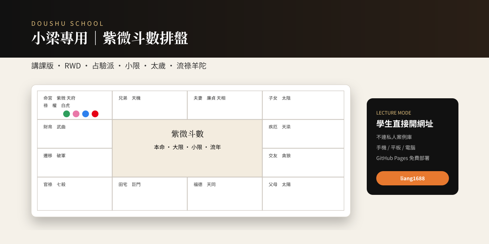
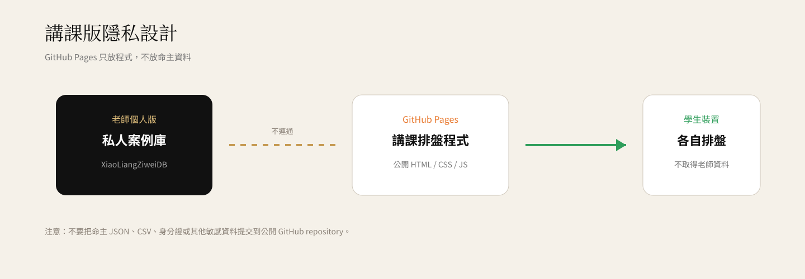

# ✦ 小梁專用｜紫微斗數排盤・講課版

<p align="center">
  
</p>

<p align="center">
  <strong>紫微斗數十二宮 × 占驗派四化 × 小限 × 太歲 × 流年祿羊陀 × 宮干飛化</strong><br>
  適合課堂展示、學生練習與少量範例排盤。
</p>

---

## ✨ 這是什麼？

這是一個為「斗數小學堂」講課情境整理的前端紫微斗數排盤工具。輸入國曆生日、出生時間與性別後，可以直接在瀏覽器產生十二宮命盤，並切換本命、大限、小限、流年、流月、流日與流時。

畫面以「專業排盤軟體的高資訊密度」為方向重新設計，但不是文墨天機的程式碼或素材複製版；排盤核心使用開源 JavaScript 套件 **iztro**，再加入小梁專用的介面、占驗派選項、飛化顯示與講課隱私模式。

> 此工具用於命理研究、教學與娛樂，不代表科學或醫療、法律、投資判斷。

---

## 🧭 v0.6 重點功能

<p align="center">
  
</p>

### 1. 三種排盤 / 四化選項

| 選項 | 目前實作 |
|---|---|
| **通行版｜全書四化** | 以 iztro 預設《紫微斗數全書》安星與四化為基礎 |
| **中州派** | 使用 iztro `zhongzhou` 安星算法 |
| **占驗派** | 目前依需求將 **庚干** 設為：太陽祿、武曲權、**天同科、天相忌** |

> 不同門派的完整參數不只四化；v0.6 的「占驗派」先落實本專案目前指定的庚干四化差異。後續若要完整對齊特定師承，可再逐項加入火鈴、天馬、截空、旬空、博士十二神等門派參數。

### 2. 四化顏色固定

- 🟢 **祿：綠色**
- 🩷 **權：粉紅色**
- 🔵 **科：藍色**
- 🔴 **忌：正紅色**

### 3. 小限過宮

運限下拉選單新增 **小限**。

小限盤採古典常見的「男順女逆」過宮框架：寅午戌年起辰、申子辰年起戌、巳酉丑年起未、亥卯未年起丑；程式以 iztro 的 `agePalace()` / `ages` 資料取得當年小限所在宮。

小限換宮時間另外提供兩種切換：

- **以年份換宮（虛歲）**：只考慮年份。
- **農曆生日後換宮**：以農曆生日作為小限換宮分界。

命盤每一宮底部也會顯示該宮對應的小限虛歲序列，方便講課時直接對照。

### 4. 流年太歲

選擇運限日期後，系統依該流年地支在十二宮中標示 **「太歲」**。

可以透過顯示選項開啟 / 關閉。

### 5. 流年祿存、擎羊、陀羅

本版另外用明確規則標示：

- 依 **流年天干** 安流年祿存。
- 祿存的下一地支位為 **流羊**。
- 祿存的上一地支位為 **流陀**。

祿存表：

| 流年天干 | 流祿 |
|---|---|
| 甲 | 寅 |
| 乙 | 卯 |
| 丙 | 巳 |
| 丁 | 午 |
| 戊 | 巳 |
| 己 | 午 |
| 庚 | 申 |
| 辛 | 酉 |
| 壬 | 亥 |
| 癸 | 子 |

### 6. 宮干飛化

點擊十二宮任一宮位後，右側顯示該宮宮干所引動的：

- 化祿 → 哪顆星 → 哪一宮
- 化權 → 哪顆星 → 哪一宮
- 化科 → 哪顆星 → 哪一宮
- 化忌 → 哪顆星 → 哪一宮

並在盤面繪製飛化線。

### 7. 紅鸞・天喜 / 白虎・喪門

- 紅鸞、天喜有獨立桃花標記。
- 白虎、喪門會由歲前十二神資料顯示。
- 流年動態星曜可與本命十二宮一起對照。

---

## 📱 RWD 講課介面

本版針對手機、平板與投影畫面壓縮十二宮資訊密度：

- 手機仍維持 4 × 4 十二宮布局。
- 星曜採直向閱讀，接近常見專業排盤工具的資訊排列習慣。
- 中央 2 × 2 顯示命主、四柱、命主身主、五行局與運限摘要。
- 小螢幕自動縮小字級，而不是把整張盤改成卡片列表。

---

## 🔐 講課版隱私

<p align="center">
  
</p>

這個 GitHub Pages 版本的原則是：**公開的是排盤程式，不是老師的命主資料。**

### 學生打開網址時

學生只會下載公開的 `index.html` 與前端程式。他們無法透過這個網站取得你個人版瀏覽器中的 `XiaoLiangZiweiDB`。

### 不要放進 GitHub 的東西

請勿把以下內容 commit 到公開 repository：

- 命主 JSON / CSV 備份
- 真實姓名＋出生資料的大量案例檔
- 身分證字號
- 聯絡方式
- 醫療、財務或其他敏感個資

---

## 🚀 GitHub Pages 免費上線

Repository 建議名稱：

```text
liang1688
```

把這一包裡面的檔案放到 repository 根目錄：

```text
liang1688/
├─ index.html
├─ .nojekyll
├─ README.md
└─ docs/
   └─ images/
      ├─ hero.svg
      ├─ features.svg
      └─ privacy.svg
```

接著到 GitHub：

**Settings → Pages → Deploy from a branch → main → /(root) → Save**

如果你的 GitHub 帳號是 `Art-liang`、repository 是 `liang1688`，一般 Project Pages 網址會是：

```text
https://art-liang.github.io/liang1688/
```

---

## 🧪 建議驗盤方式

正式拿去講課前，建議拿你已知結果的命盤逐項比對：

1. 命宮、身宮
2. 五行局
3. 十四主星位置
4. 生年四化
5. 紅鸞、天喜
6. 白虎、喪門
7. 大限起迄
8. 小限過宮
9. 流年太歲
10. 流祿、流羊、流陀
11. 庚干切換「通行版」與「占驗派」後的天相化忌差異

---

## 📚 排盤規則與技術來源

### iztro

本專案使用 [iztro](https://github.com/SylarLong/iztro) 作為主要排盤資料核心。

官方文件：

- [配置與插件：自訂四化 / 中州派 / 小限分界](https://docs.iztro.com/en_US/posts/config-n-plugin)
- [運限：小限 `agePalace()`、流年等](https://docs.iztro.com/zh_TW/posts/horoscope)
- [星曜系統：流祿、流羊、流陀等流曜](https://docs.iztro.com/zh_TW/learn/star)
- [十天干四化](https://docs.iztro.com/zh_TW/learn/mutagen)

### 本版另外核對的傳統規則

- 《紫微斗數全書》安祿存、擎羊、陀羅口訣：祿存依年干安，祿前擎羊、祿後陀羅。
- 占驗 / 另一常見四化表的庚干：太陽祿、武曲權、天同科、天相忌。

參考：

- [紫微資料庫｜基礎紫微](https://flourishastrology.com/%E7%B4%AB%E5%BE%AE%E8%B3%87%E6%96%99%E5%BA%AB/)
- [紫微斗數全書・安祿存星訣 / 安擎羊陀羅二星訣](https://libokang.com/zh-hant/guji/ziwei/%E7%B4%AB%E5%BE%AE%E6%96%97%E6%95%B8%E5%85%A8%E6%9B%B8/6/)

---

## 🎨 品牌

**斗數小學堂**

- Instagram：[@doushu_school](https://www.instagram.com/doushu_school/)
- Threads：[@doushu_school](https://www.threads.com/@doushu_school)

---

## Version

**v0.6 — 2026-10-01**

新增：占驗派庚干四化、小限過宮選項、小限盤顯示、太歲、流年祿存 / 擎羊 / 陀羅疊盤、README 圖文說明。
